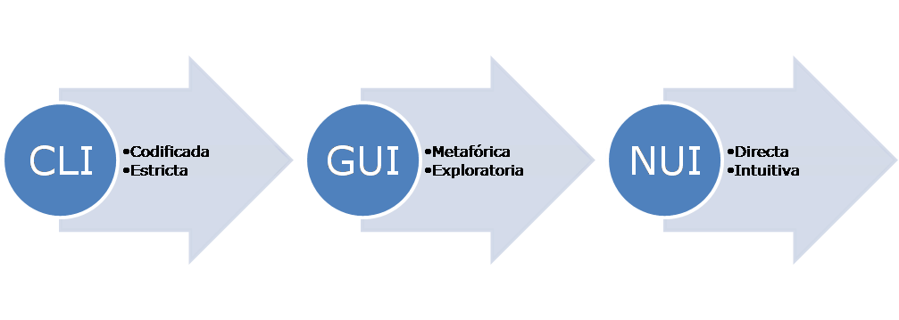

# `git init`

## Sistema de control de versiones (VCS)

## ¿Qué es Git?

## [¿Cómo usar la terminal?](#Terminal)

## Mi primer repositorio

---

## Sistema de control de versiones (VCS)

---

## ¿Qué es Git?

---

### Git git git git

Es un programa,software, etc 

---

## ¿Cómo usar la terminal?

---

### Terminal

linea de comandos (CLI), consola, terminal o _shell_ es una interfaz para comuncarnos con la computadora ejecutando programas

1. CLI: intefaz de linea de comando, o Command Line Interface
1. GUI: integaz grafica de usuario, o Graphic User Interface
1. NUI: intefaz natural de usuario, Natural User Interface

---

### Distintas terminales

ya viene instalada en el sistema operatido, pero cada uno tiene la suya:

- Windows
  - CMD
- GNU/Linux y macOS (unix-like)
  - bash

> #### Primer problema ⚠️
>
> git funciona en **bash** o terminales para sistemas operativos unix-like

---

### Usuarios de windows

Hay que instalar **bash** en el OS ([Operating system](https://es.wikipedia.org/wiki/Sistema_operativo)) o sistma operativo

- [Git for Windows](https://gitforwindows.org/)

  1. boton de `Download`
  2. la cosa se pone rara, pero hay que hacer scroll a la parte de `Assets`
  3. descargar el intalador `Git-2.31.1-32-bit.exe` o `PortableGit-2.31.1-32-bit.7z.exe`

- [Cmder](https://cmder.net/) Una mejor copcion y mi recomendada 😝
  1. hacer scroll
  2. boton `Download Full` que dice `(with Git for Windows)`

---

### Primero pasos

vamos a empezar a ejecutar programas para interactuar con la terminal:

- `pwd`: (print working directory) muestra en que directorio o carpeta estamos
- `ls`: (list) lista o miestra el contenido de la carpta actual
- `cd`: (change directory) nos permite movernos o cambiar a otra carpeta

> #### ¿que es el [prompt](https://es.wikipedia.org/wiki/Prompt)? 🤔
>
> carácter o conjunto de caracteres que se muestran en una línea de comandos para indicar que está a la espera de órdenes.
>
> suele dar info de donde estamos

---

### Parametros, argumentos, opciones o flags

- `ls -l`: `-l` es una opcion o flag que se le agrega a `ls` para decirle que muestre la version larga (long)
- `ls -a`: `-a` muestra todo (all) los que hay en la carpeta, incluidos achivos ocultos (o que empiezan con `.`)
- `ls <carpeta o path>`: le pasamos el nombre de una carpeta como parametro y nos muestra el contenido esa carpeta

  - `ls Academy`: muestra el contenido del directorio `Academy`

- `cd <carpeta o path>`: nos envia a la carpeta
  - `cd Academy`:

---

### [Path o Ruta](<https://es.wikipedia.org/wiki/Ruta_(inform%C3%A1tica)>)

es la ruta o ubicacion de un archivo o carpeta, puede ser **absoluta** o **relativo**

#### Path absoluto

es la ruta _completa_ a la carpeta o archivo en cuastion, **es unica!**

- en windows:
  - `C:\Users\tomasdisk\Documents\repos\`
  - `C:\Users\tomasdisk\Documents\repos\archivo.txt`
- en linux o mac
  - `/home/tomasdisk/Documents/repos/` (linux)
  - `/Users/tomasdisk/Documents/repos/archivo.txt` (mac)

---

### [Path o Ruta](<https://es.wikipedia.org/wiki/Ruta_(inform%C3%A1tica)>)

#### Path relativo

es la direccion a un archivo o carpeta desde otra carpeta

- en windows:
  - `Documents\repos\`
  - `.\Documents\repos\archivo.txt`
- en linux o mac
  - `Documents/repos/`
  - `./Documents/repos/archivo.txt`
  - `../Downloads/`

> #### Info 💡
>
> - carpeta `.`: es la carpeta actual, donde estamos ahora, podemos ver cual es con `pwd`
> - carpeta `..`: es la carpeta que contiene a la actual, si hacemos `cd ..` nos envia a la carpeta previa

---

### Más comandos (o programas) 🤯

- `mkdir`: (make directory) crea un nuevo directorio
  - `mkdir nueva_carpeta`: crea un directorio o carpeta llamado `nueva_carpeta`

- `cp <origen> <destino>`: (copy) crea una copia de un archivo
  - `cp archivo_original archivo_copia`: copia el archivo llamado `archivo_original` creando uno nuevo llamado `archivo_copia`

- `mv <origen> <destino>`: (move) mueve un archivo, tambien se usa para renombrar un archivo
  - `mv Downloads\archivo.txt Documents\repos\info.txt`: mueve el archivo `archivo.txt` ubuncado en `Downloads` a la carpeta `Documents\repos\` cambiandole el nombre a `info.txt`

- `rm <archivo>`: (remove) elimina un archivo o carpeta si se usa el flag `-r` de recursión
  - `rm Documents\repos\info.txt`: elimina el archivo `info.txt` en el directorio `Documents\repos\`
  - `rm -r Documents\repos`: elimina la carpeta `Documents\repos\` y todos los archivos y carpetas que contenga

---

## Mi primer repositorio

---

### Crear un repocitorio

   <!-- git init, status, add, commit, remote add, clone, push  -->

---

_[Clase siguiente](clase2.gitRemote.md)_

_[Volver al listado de clases](../git.md)_
